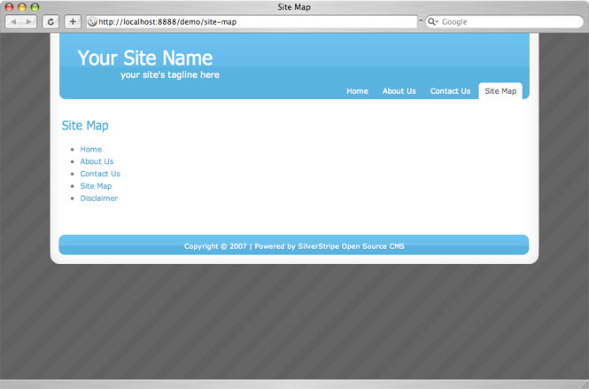
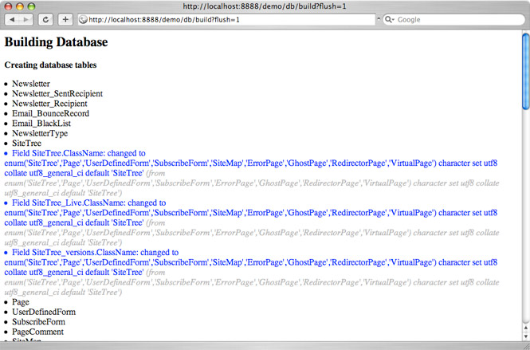
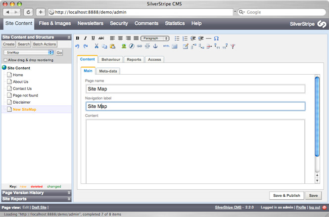
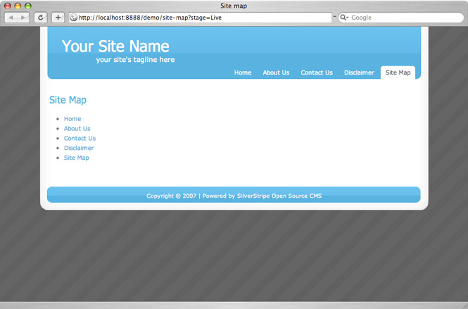
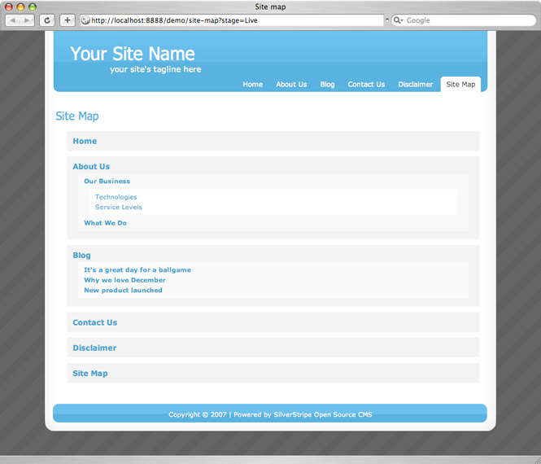

# ** Site Map Module Released **

A module has been released that supersedes the code used in this tutorial and makes it even simpler to create a
human-readable HTML site map page for your website. You can easily configure the Title, URL, page types to hide and
permissions check. It also includes 2 themes out of the box and more can be added.

Check it out here: http://silverstripe.org/site-map-module-module/

If you have any queries, amendments or new themes to discuss, you can find the module maintainer DesignCity on IRC most
weeks.

# Overview

This is a short tutorial demonstrating how to quickly add a Site Map to a SilverStripe site. While it is recommended
that you have completed the earlier tutorials, you should be able to simply copy/paste your way through this. You can
add the Site Map to a fresh install or to the tutorial site.

# What are we working towards?

We are going to add a site map to your site. The site map will contain a list of all of the pages on your site, even if
you have deselected the "Show in menus?" option on the Behaviour tab (To obey your "Show in menus?" option for top-level
pages, uncomment line 26 in SiteTree.php) . The site map will also ignore all pages with the ErrorPage type.

# Step 1: Creating the page type

We now need to create a page type so we can display the site map. Navigate to your */mysite/code* directory and create a
new file called **SiteMap.php**. SiteMap.php should contain the following:

	:::php
	<?php
	 
	class SiteMap extends Page {
		static $db = array(
		);
		static $has_one = array(
		);
	}
	 
	class SiteMap_Controller extends Page_Controller {
	   
		/**
	
		 * This function will return a unordered list of all pages on the site.
		 * Watch for the switch between $page and $child in the second line of the foreach().
		 * 
		 * Note that this will only skip ErrorPage's at the top/root level of the site. 
		 * If you have an ErrorPage class somewhere else in the hierarchy, it will be displayed.
		 */
	 function SiteMap() {
	  $rootLevel = DataObject::get("Page", "ParentID = 0"); // Pages at the root level only
	  $output = "";
	  $output = $this->makeList($rootLevel);
	  return $output;
	 }
	
	 private function makeList($pages) {
	  $output = "";
	  if(count($pages)) {
	    $output = '
	    <ul id="sitemap-list">';
	   foreach($pages as $page) {
	    if(!($page instanceof ErrorPage) && $page->ShowInMenus && $page->Title != $this->Title){
	     $output .= '
	      <li><a href="'.$page->URLSegment.'" title="Go to the '.Convert::raw2xml($page->Title).' page">'.Convert::raw2xml($page->MenuTitle).'</a>';
	     $whereStatement = "ParentID = ".$page->ID;
	     //$childPages = new DataObjectSet();
	     $childPages = DataObject::get("Page", $whereStatement);
	     $output .= $this->makeList($childPages);
	     $output .= '
	      </li>';
	    }
	   }
	   $output .= '
	    </ul>';
	  }
	  return $output;
	 }
	}
	
	?>

# Step 2: Rebuild the Database

Before continuing, we need to flush the database so that SilverStripe knows that we've just added a new page type. Visit
*http:*yoursite.com/dev/build //.  You should be presented with a screen that looks like the following:

# Step 3: Creating the site map in the CMS

Now we need to create a new page in the CMS. 

Launch the CMS (or refresh if the CMS was open when you rebuilt the database) and create a new SiteMap page. Save &
Publish and we're done in the CMS. You don't need to enter anything into the Content box.

# Step 4: Create the template for the site map

Next we need to create the template used to display the site map. You need to create a file called **SiteMap.ss** in the
following location: */mysite/templates/Layout/SiteMap.ss*. You'll know that you have the right directory becuase there
should already be a Page.ss file in there. If you're following the turotials, you might find
/tutorial/templates/Layout/SiteMap.ss will work for you.

SiteMap needs to include "**$SiteMap**" where you want the site map to appear. Here's an example from the Blackcandy
theme:

	:::php
	

		<% if Menu(2) %>
			<% include SideBar %>
			

		<% end_if %>
				
		<% if Level(2) %>
		  	<% include BreadCrumbs %>
		<% end_if %>
		
			<h2>$Title</h2>
		
			$Content
			$SiteMap 
			$Form
			$PageComments
		
		<% if Menu(2) %>
			

		<% end_if %>
	

If you don't have any experience using the templates, use the contents of mysite/templates/Layout/Page.ss as a base and
add in "**$SiteMap**" below "$Content".

# Look mum, a site map!

That's it. You should now be able to navigate to the sitemap from your home page, and behold its respendid beauty.

Don't think it's so beautiful? The next section will give you some CSS to help you make it more attractive!

# Step 5: Styling your site map

There are plenty of resources for how to style a site map well:

*  Try A List Apart's article "Spruced-Up Site Maps" (http://www.alistapart.com/articles/sprucemaps)
*  Or BeTech's CSS Sitemap (http://betech.virginia.edu/index.php/2007/10/03/css-sitemap/)
*  Or Zab Design's work (http://www.zabdesign.de/pro/public/sitemap/sitemap-styled.html)
*  Or make it really easy for yourself and design it exactly like Silverstripe's Tree with two simple includes
(http://www.silverstripe.com/tree-control/)

However, if you're looking to get it the way you want it, there's nothing to do other than get your hands dirty. Here's
some code that can get you started:

	:::css
	/************************
	SITEMAP
	
	************************/
	#sitemap-list {padding:0 0 0 10px; margin:0; list-style:none; font-weight:bold; line-height:150%} /*1st level list*/
	
	#sitemap-list li {padding:10px; margin-top:10px; font-size:13px; background:#f0f0f0;} /*1st level items*/
	
	#sitemap-list ul {margin:5px 10px 5px 10px; padding:5px 10px; font-weight:normal; background:#f8f8f8;} /*2nd level lists*/
	
	#sitemap-list li li {padding:0; margin:0; list-style:none; font-weight:bold; font-size:11px; line-height:18px; background:none} /*2nd level items*/
	
	#sitemap-list ul ul {margin-left:10px;padding:5px 10px;  background:#fff;} /*3rd level lists*/
	
	#sitemap-list li li li {font-size:11px; font-weight:normal;} /*3rd level items*/

And Voila!

# Summary

This tutorial has shown how easy it is to have SilverStripe create a site map for you on your next SilverStripe project.
