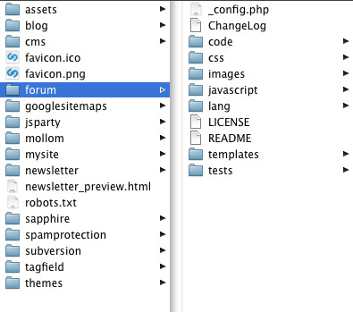

# Introduction

The directory-structure in Silverstripe it built on "convention over configuration", so the placement of some files and
directories is meaningful to its logic.
 
## Core Structure

 | Directory | Description                                                                                              
                                                                                                                 | 
 | --------- | -----------                                                                                              
                                                                                                                 | 
 | assets/   | Contains images and other files uploaded via the SilverStripe CMS. You can also place your own content
inside it, and link to it from within the content area of the CMS.                                                  | 
 | cms/      | Contains all the files that form the CMS area of your site. It’s structure is similiar to the mysite/
directory, so if you find something interesting, it should be easy enough to look inside and see how it was built. | 
 | sapphire/ | The framework that builds both your own site and as the CMS that powers it. You’ll be utilizing files
in this directory often, both directly and indirectly.                                                             | 

## Custom Code Structure

We're using *<mysite>* as an example - arbitrary directory-names are allowed, as long as they don't collide with
existing modules or the directories listes in "Core Structure".

 | Directory           | Description                                                         | 
 | ---------           | -----------                                                         | 
 | <mysite>/           | This directory contains all of your code that defines your website. | 
 | <mysite>/code       | PHP code for model and controller (subdirectories are optional)     | 
 | <mysite>/templates  | HTML [templates](templates) with *.ss-extension                     | 
 | <mysite>/css        | CSS files                                                           | 
 | <mysite>/images     | Images used in the HTML templates                                   | 
 | <mysite>/javascript | Javascript and other script files                                   | 
## Themes Structure

 | themes/blackcandy/      | Standard "blackcandy" theme                                         | 
 | ------------------      | ---------------------------                                         | 
 | themes/blackcandy_blog/ | Theme additions for the blog module                                 | 
 | themes/yourtheme/       | The themes folder can contain more than one theme - here's your own | 

See themes:[:themes:developing](/themes/developing)

## Module Structure

Modules are currently top-level folders that need to have a *_config.php*-file present.
They should follow the same conventions as posed in "Custom Site Structure"

Example Forum:
 | Directory  | Description                                                         | 
 | ---------  | -----------                                                         | 
 | forum/     | This directory contains all of your code that defines your website. | 
 | forum/code | PHP code for model and controller (subdirectories are optional)     | 
 | ...        | ...                                                                 | 

## PHP Include Paths

Due to the way [ManifestBuilder](ManifestBuilder) recursively detects php-files and includes them through PHP5's
//__autoload()//-feature, you don't need to worry about include paths. Feel free to structure your php-code into
subdirectories inside the *code*-directory.

# Best Practices

## Making /assets readonly
See [secure-development#filesystem](secure-development#filesystem)
